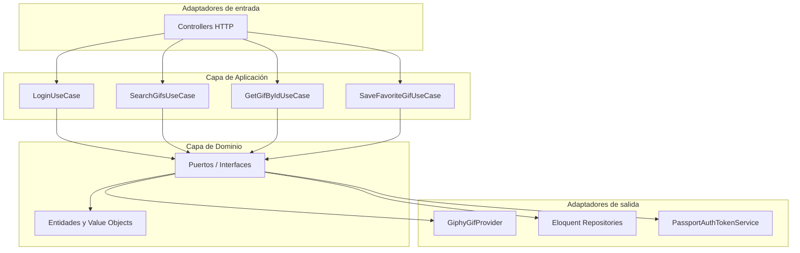
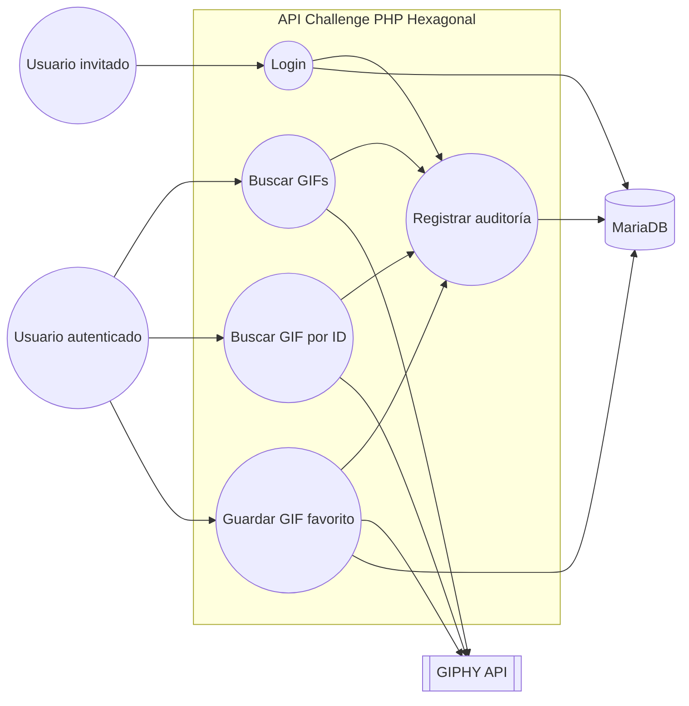
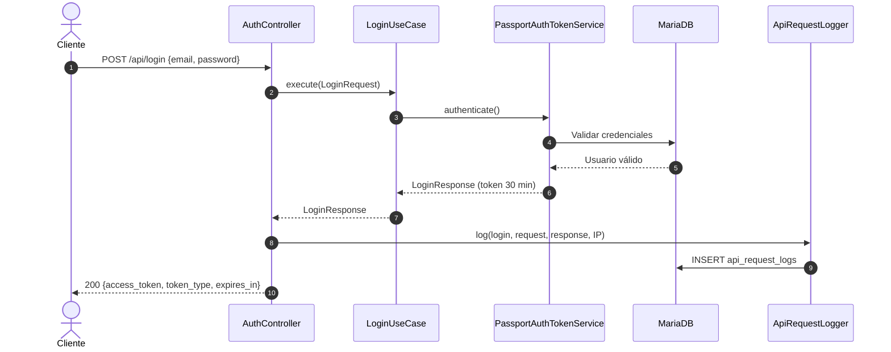
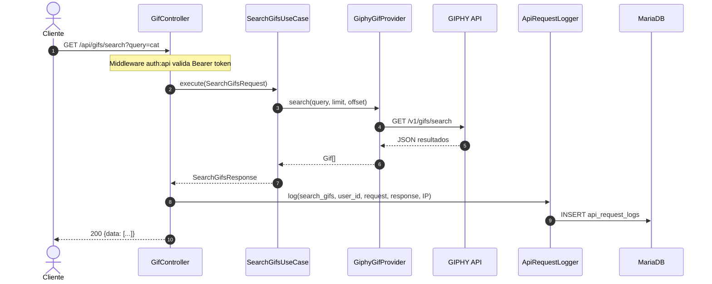
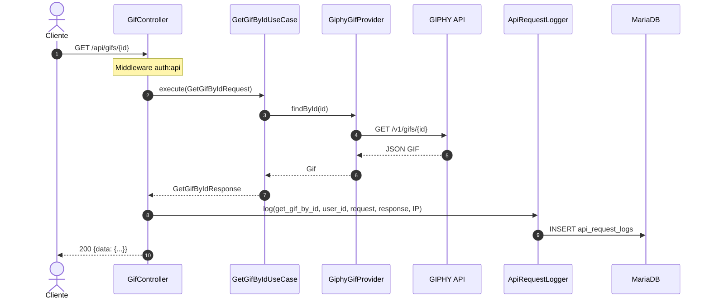
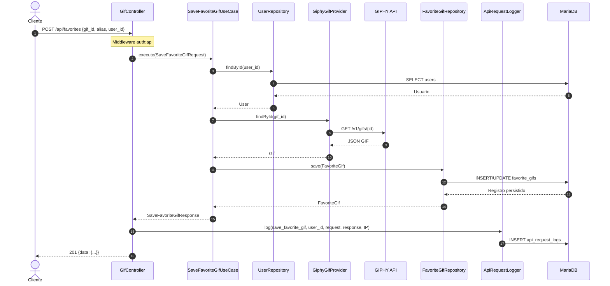
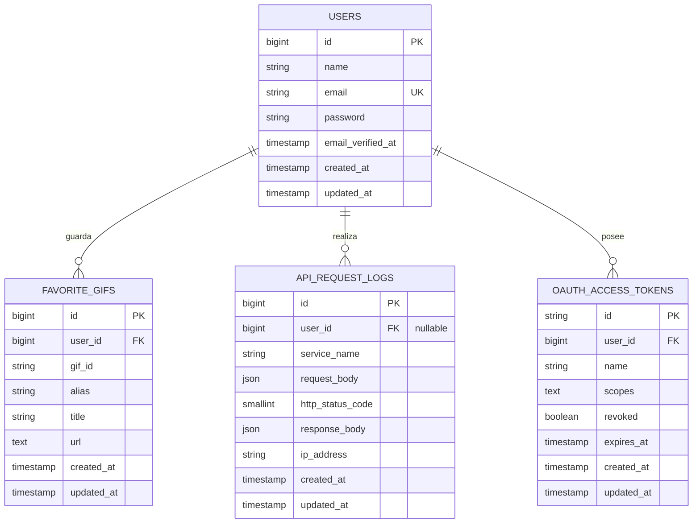

# Challenge PHP Hexagonal

API REST de GIFs desarrollada con **PHP 8.3**, **Laravel 11**, **MariaDB**, **Docker** y **arquitectura hexagonal + DDD**.

Integra la API externa de [GIPHY](https://developers.giphy.com/docs/api/) y expone servicios autenticados con **OAuth2 (Laravel Passport)**.

## Tabla de contenidos

- [Requisitos](#requisitos)
- [Arquitectura](#arquitectura)
- [Servicios expuestos](#servicios-expuestos)
- [Despliegue con Docker](#despliegue-con-docker)
- [Variables de entorno](#variables-de-entorno)
- [Tests](#tests)
- [Colección Postman](#colección-postman)
- [Diagrama de Casos de Uso](#diagrama-de-casos-de-uso)
- [Diagramas de Secuencia](#diagramas-de-secuencia)
- [Diagrama Entidad-Relación (DER)](#diagrama-entidad-relación-der)

## Requisitos

- Docker y Docker Compose
- API Key de GIPHY ([crear en developers.giphy.com](https://developers.giphy.com/))

## Arquitectura

El proyecto separa responsabilidades en tres capas principales:

```
src/
├── Domain/           # Entidades, value objects y puertos (interfaces)
├── Application/      # Casos de uso y DTOs
└── Infrastructure/   # Adaptadores (HTTP, Eloquent, GIPHY, Passport)
```

### Principios aplicados

- **Hexagonal**: el dominio no conoce Laravel, HTTP ni GIPHY.
- **DDD**: entidades, value objects (`Email`), excepciones de dominio y repositorios como puertos.
- **Bajo acoplamiento**: integración con GIPHY mediante `GifProvider`.
- **Alta cohesión**: cada caso de uso encapsula una intención de negocio.
- **Persistencia de auditoría**: toda interacción queda registrada en `api_request_logs`.



## Servicios expuestos

| Servicio | Método | Ruta | Auth | Descripción |
|----------|--------|------|------|-------------|
| Login | `POST` | `/api/login` | No | Autenticación OAuth2. Devuelve token con expiración de 30 minutos |
| Buscar GIFs | `GET` | `/api/gifs/search` | Sí | Búsqueda por término (`query`, `limit`, `offset`) |
| Buscar GIF por ID | `GET` | `/api/gifs/{id}` | Sí | Detalle de un GIF específico |
| Guardar favorito | `POST` | `/api/favorites` | Sí | Persiste un GIF favorito para un usuario |

### Ejemplos

**Login**

```http
POST /api/login
Content-Type: application/json

{
  "email": "demo@challenge.test",
  "password": "password123"
}
```

**Respuesta**

```json
{
  "access_token": "eyJ0eXAiOiJKV1QiLCJhbGc...",
  "token_type": "Bearer",
  "expires_in": 1800
}
```

**Buscar GIFs**

```http
GET /api/gifs/search?query=cat&limit=10&offset=0
Authorization: Bearer {token}
```

**Guardar favorito**

```http
POST /api/favorites
Authorization: Bearer {token}
Content-Type: application/json

{
  "gif_id": "13Hun5iBAAZC8",
  "alias": "Mi GIF favorito",
  "user_id": 1
}
```

## Despliegue con Docker

### 1. Clonar el repositorio

```bash
git clone https://github.com/santiagohubert/Challenge-PHP-Hexagonal.git
cd Challenge-PHP-Hexagonal
```

### 2. Configurar GIPHY API Key

Crear un archivo `.env` a partir del ejemplo y definir la clave:

```bash
cp .env.example .env
```

Editar `.env`:

```env
GIPHY_API_KEY=tu_api_key_de_giphy
```

También puede exportarse al levantar Docker:

```bash
GIPHY_API_KEY=tu_api_key docker compose up --build -d
```

### 3. Levantar la aplicación

```bash
docker compose up --build -d
```

El entrypoint ejecuta automáticamente:

- Generación de `APP_KEY`
- Migraciones de base de datos
- Seed de usuario demo
- Instalación de Laravel Passport (OAuth2)

### 4. Verificar

```bash
curl http://localhost:8080/up
```

La API quedará disponible en `http://localhost:8080`.

### Usuario demo

| Campo | Valor |
|-------|-------|
| Email | `demo@challenge.test` |
| Password | `password123` |

## Variables de entorno

| Variable | Descripción | Default |
|----------|-------------|---------|
| `APP_URL` | URL base de la aplicación | `http://localhost:8080` |
| `DB_HOST` | Host de MariaDB | `mysql` |
| `DB_DATABASE` | Nombre de la base | `challenge_gifs` |
| `DB_USERNAME` | Usuario de base | `challenge` |
| `DB_PASSWORD` | Contraseña de base | `secret` |
| `GIPHY_API_KEY` | API Key de GIPHY | *(requerida)* |
| `GIPHY_BASE_URL` | Base URL de GIPHY | `https://api.giphy.com/v1` |
| `PASSPORT_TOKEN_EXPIRATION_MINUTES` | Expiración del token OAuth2 | `30` |

## Tests

Tests unitarios (dominio y casos de uso) y tests de feature (rutas, auth y auditoría):

```bash
composer install
composer test
```

Dentro de Docker (con dependencias de desarrollo incluidas):

```bash
docker compose exec app ./vendor/bin/phpunit
```

Casos cubiertos:

- Validación de `Email`
- Reglas de negocio de búsqueda de GIFs
- Guardado de favoritos con validación de usuario
- Login OAuth2 y expiración del token
- Rutas protegidas y prefijo `/api`
- Auditoría de login con `user_id`
- Validación de `user_id` contra el usuario autenticado

## Colección Postman

Importar:

- `postman/Challenge-PHP-Hexagonal.postman_collection.json`
- `postman/Challenge-PHP-Hexagonal.postman_environment.json`

**Automatización del token:** el request **Login** incluye un script de test que guarda `access_token`, `token_type` y `expires_in` en el environment. Los demás endpoints usan `{{access_token}}` como Bearer token.

Orden sugerido de ejecución:

1. Login
2. Search GIFs
3. Get GIF By ID
4. Save Favorite GIF

---

## Diagrama de Casos de Uso



---

## Diagramas de Secuencia

### Login



### Buscar GIFs



### Buscar GIF por ID



### Guardar GIF favorito



---

## Diagrama Entidad-Relación (DER)



### Descripción de entidades

- **users**: usuarios del sistema autenticados vía OAuth2.
- **favorite_gifs**: GIFs marcados como favoritos por usuario (integración validada contra GIPHY).
- **api_request_logs**: auditoría de cada servicio invocado (servicio, request, response, HTTP code, IP y usuario).
- **oauth_access_tokens**: tokens OAuth2 emitidos por Laravel Passport (expiración configurable: 30 minutos).

---

## Estructura del proyecto

```
Challenge-PHP-Hexagonal/
├── src/
│   ├── Domain/
│   ├── Application/
│   └── Infrastructure/
├── app/
├── config/
├── database/
│   ├── migrations/
│   └── seeders/
├── docker/
├── postman/
├── routes/
├── tests/
├── Dockerfile
├── docker-compose.yml
└── README.md
```

## Autor

Santiago Hubert — Desafío técnico PHP Hexagonal
